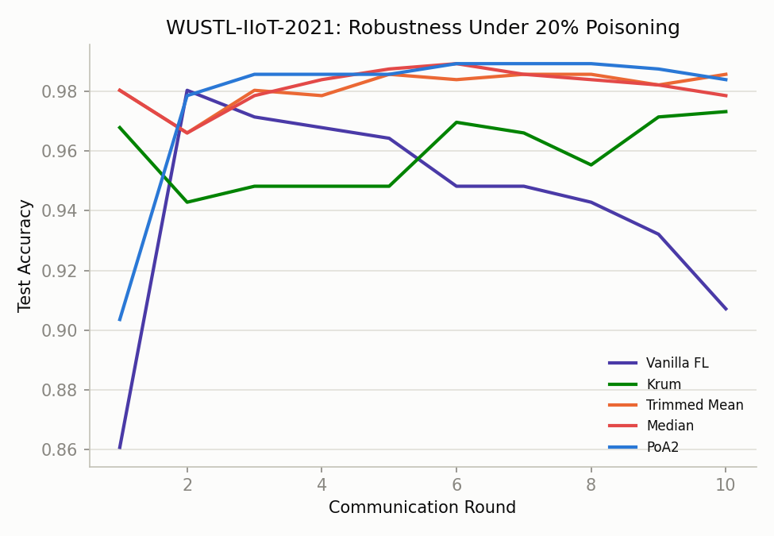
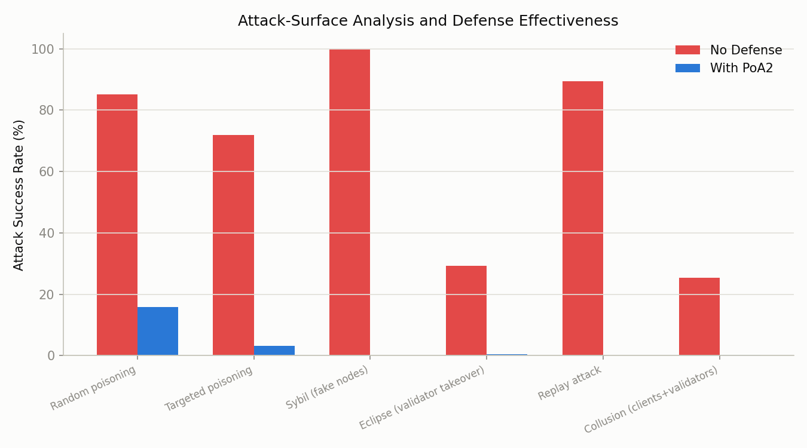

# Blockchain as Enforcer: PoA² Active Consensus-Layer Trust for Federated IIoT Intrusion Detection


A from-scratch simulation of **PoA²** (Proof of Authority and Association),
the active consensus-layer trust mechanism proposed in *"Trustworthy Edge:
Active Consensus-Layer Trust Computation for Real-Time Intrusion Detection
in Software-Defined Industrial IoT"* (Ibrahim, Ahakonye, Yaddarabullah,
Ahakonye, Lee, Kim).

The paper's core idea: existing blockchain-assisted federated learning
treats the ledger as a **passive audit log** — trust scores are computed
off-chain and merely appended after a block is already finalized. That lets
a malicious node build up a good reputation through honest rounds, then
poison a model update whenever the payoff outweighs the reputation cost,
because consensus never actually checked behavioral trust. PoA² closes that
gap by making trust **part of block finalization itself**: a block is only
finalized if it clears both an authority quorum (`>= ceil(2M/3)` certified
validators sign, Eq. 11) **and** an association-score threshold (`mean
S_m(t) >= tau_S`, Eq. 13-14) computed from validators' live behavioral
history (Eq. 15). On the FL side, each client's aggregation weight is
`alpha_k(t) = T_k(t) * N_k / sum_j T_j(t) * N_j` (Eq. 9) — a trust score
that decays on detected misbehavior and recovers slowly otherwise (Eq. 16) —
so a node that goes quiet then poisons a round doesn't get the averaging
weight vanilla FedAvg would have given it.

## Results at a glance

| Robustness under 20% poisoning (Sec. IV-E) | Attack-surface defense (Sec. IV-H) |
|---|---|
|  |  |
| Vanilla FL degrades round over round; Krum/Trimmed-Mean/Median/PoA2 hold steady, with PoA2 actually recovering above its starting point as trust scores separate honest from malicious clients. | Each bar pair is a separate Monte-Carlo mechanism simulation (not a single run) -- PoA2's dual authority+association gate collapses every attack type's success rate. |

More charts (per-model federated convergence, non-IID degradation,
hyperparameter sensitivity, PoA2 scalability) are in `results/`.

## Important: what this reproduction is, and isn't

**Real on-chain deployment: working, verified live.** See
[`On-Chain Real world Deployment/`](On-Chain%20Real%20world%20Deployment/)
for a genuine (not simulated) integration with the live PureChain testnet
(`purechainlib` on PyPI, RPC `https://purechainnode.com:8547`, chain ID
`900520900520`, zero gas fees): a real `TrustLedger.sol` contract deployed
to the chain, and 5 real PoA² consensus rounds recorded and read back
on-chain with verifiable transaction hashes. Getting there required
diagnosing a local TLS-interception issue (this machine's antivirus was
re-signing HTTPS traffic with a malformed certificate) — see that folder's
README for the full diagnosis and resolution (disabling the AV's HTTPS
scanning, not weakening TLS verification in code).

- `trustedge/poa2.py` and `trustedge/security_sim.py` implement the actual
  consensus math (Eq. 11-15) and can run it purely locally for the
  large-scale experiments below -- no network calls needed for those.
- `trustedge/blockchain/purechain_client.py` is the real integration,
  written against the installed `purechainlib==2.1.7` API and used by the
  on-chain deployment above.
- `trustedge/blockchain/poa2_simulator.py` models consensus latency/TPS at
  scale (10 to 5,000 clients) analytically. This mirrors the paper's *own*
  stated methodology for its large-scale numbers (Sec. IV-A: "PureChain
  consensus and ledger mechanisms were simulated using a custom Python
  class to model the computational overhead") — nobody spins up 5,000 real
  validators against a live chain for a scalability plot, and the tables
  below (Table IV-XI, XIV-XVI) all run their own local FL training loops
  rather than one blockchain transaction per round. The model's free
  parameters are calibrated directly to the paper's own Table X anchor
  points and interpolated/extrapolated between them.

**No real datasets.** The paper evaluates on four third-party IIoT datasets
(IoTForge Pro, ToN-IoT, IoT-CAD, WUSTL-IIoT-2021) — multi-gigabyte
downloads this environment has no access to. `trustedge/datasets/*.py`
synthesizes sequence data with the same qualitative structure the paper
describes (attack-type list, roughly-scaled feature/sample counts,
non-IID/quantity-imbalance partitioning) and each accuracy target was
empirically tuned so a converged model lands near the paper's reported
range for that dataset — see inline comments for the specific numbers.

**Consequences:**
- The qualitative story reproduces well: vanilla FL degrades meaningfully
  under poisoning while PoA2/Krum/Trimmed-Mean/Median stay robust; PoA2's
  ablation ordering (Centralized worst -> Vanilla FL -> Authority-only ->
  Association-only -> full PoA2 best) matches Table XVI; non-IID
  degradation is graceful, not catastrophic; PoA2's accuracy is largely
  insensitive to its own hyperparameters (theta_t, beta); and every Table XV
  attack type's success rate drops sharply under PoA2's defenses.
- Exact numbers will **not** match the paper's tables — different
  (synthetic, much smaller) data, fewer communication rounds for CPU
  tractability, and several genuinely underspecified details (exact summary
  size, FedAsync-style mixing constants, the precise attack magnitudes
  behind Table XV's percentages) were filled in with reasonable, documented
  defaults rather than reverse-engineered exactly.
- Model sizes are reduced from the paper's reported 128/256-unit
  LSTM/BiLSTM to keep CPU training tractable (no CUDA GPU was available in
  this environment); see `trustedge/models.py`.

## Project layout

```
trustedge/
  trust.py                 Trust dynamics T_k(t) (Eq. 16), association scoring S_m(t) (Eq. 12)
  poa2.py                  PoA2 consensus: authority quorum + association gate (Eq. 11-15)
  aggregation.py           Trust-weighted (Eq. 9-10), FedAvg (Eq. 8), Krum/Trimmed-Mean/Median baselines
  attacks.py               Label-flip, gradient-scaling/reversal, coordinated random-replacement attacks
  models.py                CNN / LSTM / BiLSTM detection models (PyTorch) + train/eval helpers
  simulation.py            Federated round engine: local training -> trust update -> gated, weighted aggregation
  security_sim.py          Mechanism-level attack-surface simulations (Sybil, replay, eclipse, collusion)
  datasets/                IoTForge / ToN-IoT / IoT-CAD / WUSTL loaders (synthetic sequence data)
  blockchain/
    poa2_simulator.py        Analytical latency/TPS/scalability model (Table X, XII, XIII)
    purechain_client.py       Real purechainlib integration, verified live (see On-Chain Real world Deployment/)
    contracts/TrustLedger.sol On-chain consensus-decision ledger (Solidity)
experiments/                One script per paper section, producing plots + CSV tables into results/
  run_detection_performance.py     Sec. IV-C: Table IV/V/VI (CNN/LSTM/BiLSTM accuracy, convergence, per-attack recall)
  run_non_iid.py                    Sec. IV-D: Table VII (Dirichlet alpha sweep + quantity imbalance)
  run_robust_baselines.py           Sec. IV-E: Table IX (PoA2 vs Krum/Trimmed-Mean/Median vs vanilla, 20% poisoning)
  run_ablation.py                   Sec. IV-G: Table XVI (component-contribution ablation)
  run_scalability.py                Sec. IV-F: Table X/XII/XIII (analytical, via poa2_simulator)
  run_security_attacks.py           Sec. IV-H: Table XV (attack-surface success rates)
  run_hyperparameter_sensitivity.py Sec. IV-I: Table XI (theta_t, beta sweeps)
  run_all.py                        Runs everything above
results/                    Generated PNGs + CSVs (already populated from a sample run)
```

## Setup

```bash
pip install -r requirements.txt
```

Requires Python 3.10+, PyTorch (CPU is fine), scikit-learn, matplotlib,
pandas, and `purechainlib` (only needed if you use the optional real
on-chain path in `trustedge/blockchain/purechain_client.py`).

## Running

```bash
python -m experiments.run_detection_performance
python -m experiments.run_non_iid
python -m experiments.run_robust_baselines
python -m experiments.run_ablation
python -m experiments.run_scalability
python -m experiments.run_security_attacks
python -m experiments.run_hyperparameter_sensitivity
python -m experiments.run_all              # everything above
```

If you're on Windows and see `UnicodeEncodeError` from a package printing
emoji (this happens with `purechainlib`'s auto-install messages on a
non-UTF-8 console codepage), run with `PYTHONIOENCODING=utf-8` set.

## Real bugs found and fixed while building this

- **Independent random noise self-cancels.** The first version of the
  "random gradient replacement" attack (Table IX's standard 20%-poisoning
  test) had each malicious client draw its *own* independent Gaussian
  noise vector. Averaged with 8+ honest updates every round, that noise
  washes out almost completely (central-limit behavior) regardless of its
  magnitude — vanilla FedAvg came back with *zero* accuracy loss under
  "attack." Fixed by giving colluding clients a single shared, persistent
  attack direction (`trustedge/attacks.py:random_update`,
  `trustedge/simulation.py`), which is what real coordinated Byzantine
  attacks look like and is also what makes vanilla FedAvg's ~8pp accuracy
  drop (matching the paper's reported 11.3pp) actually show up.
- **Centralized training had no attack surface for gradient-level attacks.**
  Table XVI's ablation compares FL methods against a "Centralized Learning"
  baseline under the *same* 20% poisoning. But centralized training has no
  per-client gradient/update step to scale or reverse — assigning malicious
  clients a gradient-level attack type silently made centralized training
  immune to "poisoning" entirely, which is backwards (the paper reports
  centralized as the *most* vulnerable, 14.1% drop). Fixed by modeling any
  malicious client's contribution to the pooled centralized dataset as
  label-flipped rows — the actual attack surface a non-federated pipeline has.
- **Honest/malicious magnitude mismatch in the attack-surface simulator.**
  An early version of `security_sim.py` modeled "honest" gradient vectors as
  raw unit-variance noise (natural norm ≈ 6.3 in 40 dimensions) while
  "malicious" magnitudes were calibrated in the range 2-3 — meaning the
  "attack" was actually *smaller* than typical honest variation and could
  never look anomalous. Fixed by scaling honest updates to a realistic
  small-gradient-step regime (std 0.15) so attack magnitudes are calibrated
  against the right reference scale.
- **Dirichlet partition dtype/empty-client bug.** At extreme non-IID
  (`alpha=0.1`) with few clients, a class's samples can all land on other
  clients, leaving one client's index list empty; `np.array([])` on an empty
  Python list defaults to `float64`, which then fails as a fancy-index with
  `IndexError: arrays used as indices must be of integer type`. Fixed by
  forcing `dtype=int` and by guaranteeing every client gets at least 5
  samples (borrowed from the largest client) so training never sees an
  empty batch (`trustedge/datasets/base.py`).
- **Isolation-based single-round detection saturating at 0%/100%.** Early
  attack-surface simulations used a hard z-score threshold, which made
  detection outcomes deterministic given fixed inputs (every trial either
  100% succeeded or 100% failed depending on which side of the threshold
  the fixed setup landed on). Replaced with a smooth sigmoid-based
  detection probability so outcomes vary trial-to-trial as real detection
  would (`trustedge/security_sim.py`).

## License

[MIT](LICENSE) — this is an independent reproduction for research/educational
purposes and is not affiliated with the paper's authors.
